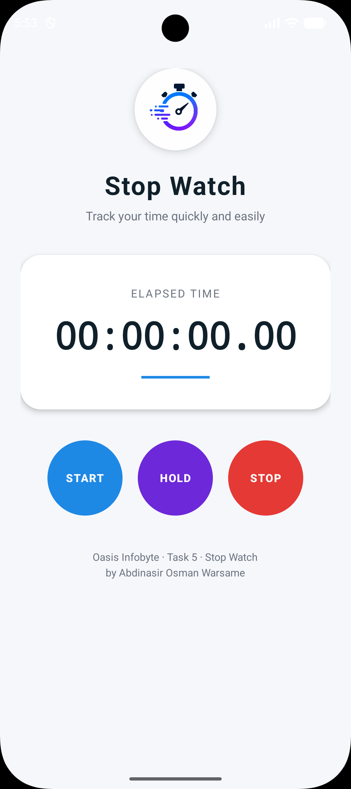
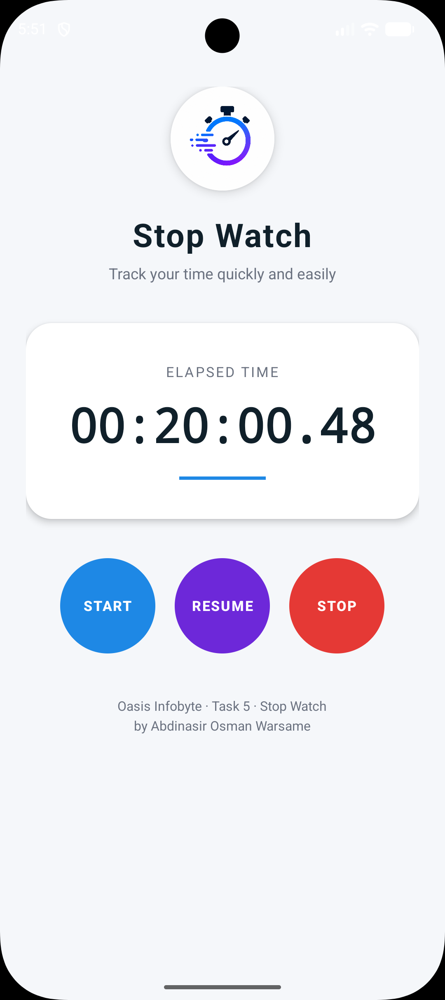

# OIBSIP Android Task 5 - Stop Watch App

<p align="center">
  
</p>

<p align="center">
  <b>A clean, native Android stopwatch app built with Java and XML.</b><br/>
  Built for the Oasis Infobyte Android Application Development Internship - Task 5.
</p>

## 1. Overview
This is a native Android application that functions like a classic handheld stopwatch. It measures the time elapsed between activation and deactivation with centisecond precision. The app uses a clean, modern interface and is fully responsive.

## 2. Internship Information
* **Organization:** Oasis Infobyte
* **Program:** Android Application Development Internship
* **Task:** Task 5 - Stop Watch
* **Author:** Abdinasir Osman Warsame

## 3. Features
* START, HOLD/RESUME, and STOP stopwatch controls.
* Centisecond timer display using `HH:MM:SS.CS` format.
* Prevents duplicate timer loops when START is pressed multiple times.
* Light theme with forced dark mode disabled to avoid black screen issues.
* Custom launcher icon and clean screenshot-ready UI.

## 4. Stopwatch Controls
* **START** starts timer
* **HOLD** pauses timer
* **RESUME** continues timer
* **STOP** resets timer to `00:00:00.00` (format: `HH:MM:SS.CS`)

## 5. Technologies Used
* Java
* XML
* Android Studio
* Android SDK
* Gradle
* Handler + Runnable for timer updates

## 6. Project Structure
The repository is structured as a standard Android Studio project. Here are the key directories and files:

```text
OIBSIP_Android_Task5_StopWatch/
├── app/                  # Main application module
│   ├── src/main/java/    # Java source code for activity and timers
│   └── src/main/res/     # XML layouts, drawables, colors, themes, etc.
├── docs/
│   └── images/           # Images for this README
│       ├── logo.png
│       ├── screenshot_home.png
│       └── screenshot_running.png
├── build.gradle          # Root build configuration
└── settings.gradle       # Project settings
```

## 7. App Screenshots

<p align="center">
  
</p>

<p align="center">
  <b>Home Screen</b>
</p>

<p align="center">
  
</p>

<p align="center">
  <b>Running State</b>
</p>

## 8. How to Run

1. Clone this repository:
   ```bash
   git clone https://github.com/abdinasir600s-a11y/OIBSIP_Android_Task5_StopWatch.git
   ```

2. Open the project in **Android Studio**.

3. To build the APK from Windows terminal, run:
   ```powershell
   .\gradlew.bat assembleDebug
   ```

4. To install the APK on an attached emulator or device from Windows terminal, run:
   ```powershell
   .\gradlew.bat installDebug
   ```

## 9. Author
**Abdinasir Osman Warsame**  
Oasis Infobyte Android App Development Intern

## 10. Acknowledgement
Thank you to Oasis Infobyte for providing the opportunity to develop these skills through their Android Application Development Internship program.
